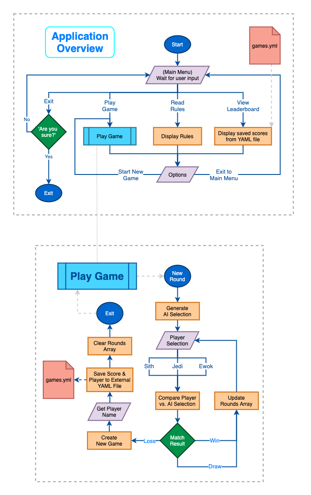

# **Terminal Application - Daniel Waldow**

### Github Repository: https://github.com/waldowred5/T1A3-Terminal-App

 

## **Software Development Plan:**

 

### **R5 - Purpose & Scope:**

 

Overview:
- The schoolyard classic, '*Scissors, Paper, Rock*' was a great past-time before the smartphone era
- Kids used to engage with each other in a simple game of wits, fist-pumping the air for a chance at victory

Problem:

- With the introduction of smartphones and their ubiquitous adoption in moden schoolyards, a legacy is at risk of becoming antique 
- To combat this, I have undertaken arguably one of the most important tasks in gaming history... to digitise '*Scissors, Paper, Rock*'
- This alone won't be enough, however. To succeed, I have made the executive decision to rebrand the classic to appeal to a younger audience
- I give you: '*Sith-Lord, Jedi, Ewok*'

Target Audience:
- '*Sith-Lord, Jedi, Ewok*' is a game targeting younger audiences who may not have grown up playing '*Scissors, Paper, Rock*', but will also more broadly appeal to fans of the Star Wars franchise

Usage:
- Users of '*Sith-Lord, Jedi, Ewok*' will be given the option to play the rebranded classic against a computer player (AI) and save highscores for bragging rights amongst their friends

 

### **R6 - Features:**

 

Main Features:
- Play Game:
  - Players play rounds of 'Sith-Lord, Jedi, Ewok' against computer player until they lose
  - Once a player 
- Leaderboard:
  - a
- Show Rules:
  - a

All Features:
- Main Menu
- Coloured Text
- Ascii Heading
- Player Selection Menus
- Display Rules
- Quote Generator
- Sound Bytes
- Leaderboard
- Save file for Leaderboard high scores
- Round Tracker
- Player Name saved in Leaderboard
- Options sub-menu
- Screen clear on each new menu
- Exit check?
- Sleep
- DEMO Mode

 

### **R7 - User Interaction Outline:**

 

*Note: The term 'user' refers to anyone interacting with any part of the application excluding the 'Play Game' functionality. In this mode, 'users' are referred to as 'players'.*

Main Menu:
- Upon launch, users will see a welcome screen which serves as the Main Menu
- Undeneath the heading banner users are asked what they would like to do
- Next to this is highlighted help text describing how to access each of the menu options (Press ↑/↓ arrow to move and Enter to select)
- The user is presented with 4 options in the Main Menu:
  - Play Game
  - Read Rules
  - View Leaderboard
  - Exit

Start New Game:
  - When a player chooses the 'Play Game' option they will be presented with a new game, which displays:
    - Round number
    - Instruction for player to choose a faction to start a new match
    - Faction options: Jedi, Sith or Ewok
  - After every match, the player will be presented with the results:
    - Win: 
      - "You won!" message displayed
      - "Round saved successfully" message displayed
      - Player is then prompted to press any key to start a new round
    - Draw: 
      - "You drew" message displayed
      - "Round saved successfully" message displayed
      - Player is then prompted to press any key to start a new round
    - Loss:
      - "You lost" message displayed
      - "Round saved successfully" message displayed 
      - Player is prompted to press any key to continue
      - Player is then prompted to enter their name (this will be used to display their score in the Leaderboard)
        - If the player enters a name with non-alphanumeric characters they will be presented with the error message, "Please enter a valid name (no special characters)". This message is part of a loop which will be displayed every time a user enters an invalid name until they enter a valid name (the validation allows for numbers so players can use aliases).
      - Thanks for playing message displayed, followed by score successfully saved message
  - Once the game is finished due to a loss, the player will then be presented with the Options Sub-Menu, displaying:
    - Iconic Star Wars quote
    - Options menu with the following options:
      - Start New Game (same as choosing Play Game from the Main Menu)
      - Exit to Main Menu

Read Rules:
  - When a player chooses the 'Read Rules' option they will be presented with a description of the rules for 'Sith-Lord, Jedi, Ewok'
  - The user is then presented with the Options Sub-Menu (see 'Start New Game', section 3)

View Leaderboard:
  - When a user chooses the 'View Leaderboard' option they will be presented with:
    - A table showing a list of scores for previously played games OR
    - If there are no scores to display, the message "No scores on the leaderboard to show!" will be displayed
    - The user is then presented with the Options Sub-Menu (see 'Start New Game', section 3)

- Exit:
  - When a user chooses the 'Exit' option they will be presented with message asking if they are sure they want to exit the application:
    - Yes: Exits the application
    - No: Returns to the Main Menu

 

### **R8 - Control Flow:**

 

 

### **R9 - Implementation Plan:**

 

- Write out list here or link to Trello board?

 

### **R9 - Help Documentation:**

 

- steps to install the application
- any dependencies required by the application to operate
- any system/hardware requirements

 

 

### *References:*